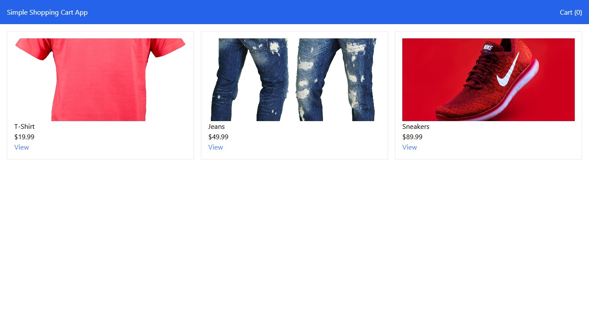

# E-commerce React App

A simple e-commerce application built with React, React Router, Context API, and Tailwind CSS.  
Features a product catalog, product details, shopping cart, and a checkout flow.

---

## Features
 Product catalog page  
 Product detail pages  
 Add to cart functionality  
 Shopping cart view  
 Checkout form with order summary  
 Cart management using React Context  
 Tailwind CSS styling  
 React Router for navigation

---

##  Getting Started

### 1. Clone the repository or unzip the project

git clone https://your-repo-url.git

cd ecommerce-app

## Demo Products
Sample products include:

T-Shirt

Jeans

Sneakers

## Checkout Flow
The checkout flow allows users to:

Add products to cart.

Proceed to the /checkout page.

Enter name, email, and shipping address.

Place order

Technologies Used
React

React Router

Tailwind CSS

Context API for state management

## Screenshots

